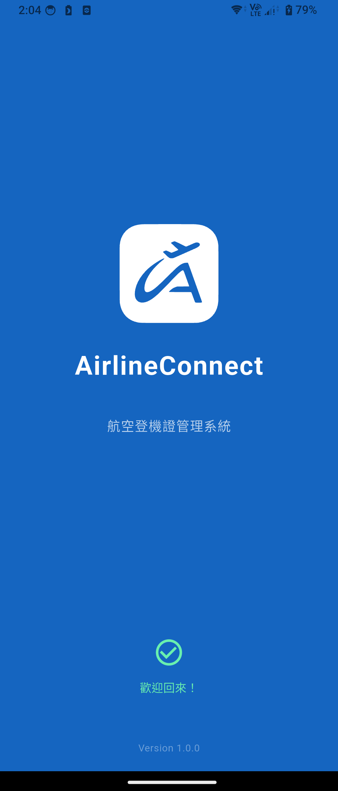
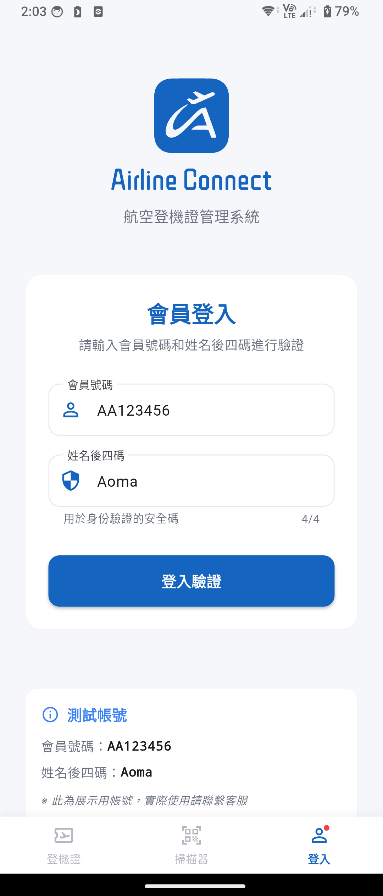
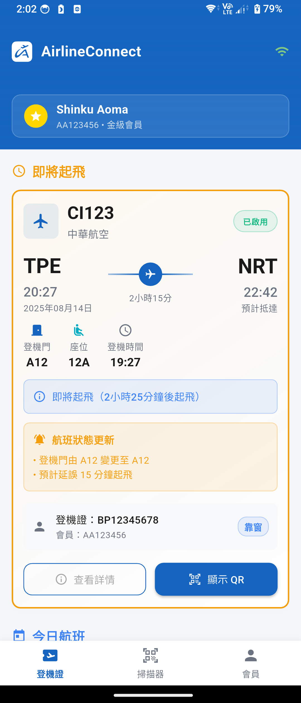
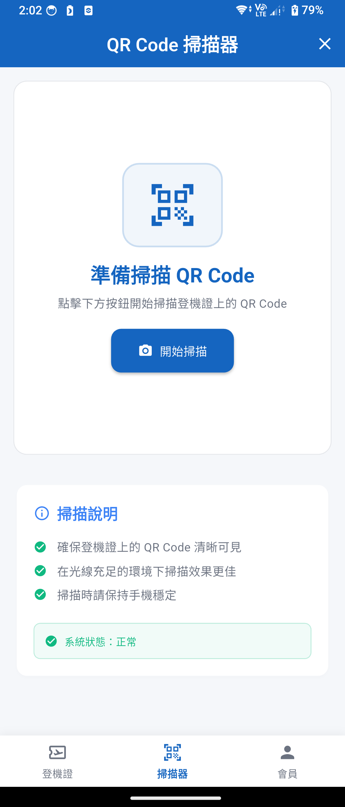
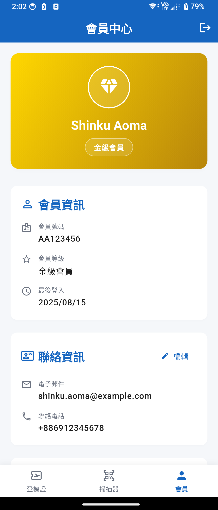

# AirlineConnect - 航空登機證管理系統

## 專案概述

AirlineConnect 是一個航空登機證管理系統，採用 Flutter 框架開發，實現跨平台的移動應用解決方案。系統提供會員認證、登機證管理、QR Code 掃描驗證等核心功能。

## 應用程式截圖

### 核心功能展示

<table>
  <tr>
    <td align="center" width="200">
      <br/>
      <b>啟動畫面</b><br/>
      <sub>應用程式載入與品牌展示</sub>
    </td>
    <td align="center" width="200">
      <br/>
      <b>會員登入</b><br/>
      <sub>會員號碼與姓名後四碼驗證</sub>
    </td>
    <td align="center" width="200">
      <br/>
      <b>登機證管理</b><br/>
      <sub>航班資訊與登機證狀態顯示</sub>
    </td>
  </tr>
  <tr>
    <td align="center" width="200">
      <br/>
      <b>QR Code 掃描</b><br/>
      <sub>登機證驗證與掃描功能</sub>
    </td>
    <td align="center" width="200">
      <br/>
      <b>會員中心</b><br/>
      <sub>個人資料與會員等級管理</sub>
    </td>
    <td align="center" width="200">
      <!-- 預留空間供未來新增 -->
    </td>
  </tr>
</table>

### 主要功能特色

| 功能模組 | 說明 | 截圖參考 |
|---------|------|----------|
| **會員認證系統** | 支援會員號碼 + 姓名後四碼雙重驗證機制 | 會員登入、會員中心 |
| **登機證管理** | 完整的登機證生命週期管理，包含狀態追蹤 | 登機證管理 |
| **QR Code 驗證** | 採用 AES-256-GCM 加密的安全 QR Code 系統 | QR Code 掃描 |
| **會員分級制度** | 支援銅級、銀級、金級會員等級管理 | 會員中心 |
| **航班資訊整合** | 即時航班狀態更新與登機時間提醒 | 登機證管理 |

## 技術架構

- **前端框架**: Flutter 3.8.1+
- **狀態管理**: Riverpod + Hooks
- **本地資料庫**: ObjectBox
- **架構模式**: Clean Architecture + DDD (Domain-Driven Design)
- **測試策略**: Unit Testing + Integration Testing

### Domain 架構設計

本專案採用 Domain-Driven Design (DDD) 架構模式，以下為核心領域實體關係圖：

```mermaid
graph TB
    %% === Core Aggregates ===
    subgraph MemberDomain [Member Domain 會員領域]
        direction TB
        Member["<b>Member</b><br/>聚合根<br/>────────────<br/>+ memberId: MemberId<br/>+ memberNumber: MemberNumber<br/>+ fullName: FullName<br/>+ tier: MemberTier<br/>+ contactInfo: ContactInfo<br/>+ createdAt: TZDateTime?<br/>+ lastLoginAt: TZDateTime?<br/>────────────<br/>+ updateLastLogin()<br/>+ updateContactInfo()<br/>+ isEligibleForBoardingPass()<br/>+ validateNameSuffix()"]
        
        MemberVO1[MemberId<br/>值物件<br/>UUID format]
        MemberVO2[MemberNumber<br/>值物件<br/>AA123456 format]
        MemberVO3[FullName<br/>值物件<br/>2-50 chars validation]
        MemberVO4[ContactInfo<br/>值物件<br/>email + phone validation]
        MemberEnum[MemberTier<br/>列舉<br/>BRONZE, SILVER<br/>GOLD, SUSPENDED]
        
        Member -.-> MemberVO1
        Member -.-> MemberVO2  
        Member -.-> MemberVO3
        Member -.-> MemberVO4
        Member -.-> MemberEnum
    end

    subgraph FlightDomain [Flight Domain 航班領域]
        direction TB
        Flight["<b>Flight</b><br/>聚合根<br/>────────────<br/>+ flightNumber: FlightNumber<br/>+ schedule: FlightSchedule<br/>+ status: FlightStatus<br/>+ aircraftType: String<br/>+ createdAt: TZDateTime<br/>+ updatedAt: TZDateTime?<br/>────────────<br/>+ updateStatus()<br/>+ updateSchedule()<br/>+ isActive<br/>+ isBoardingEligible"]
        
        FlightVO1[FlightNumber<br/>值物件<br/>BR857, CI101 format]
        FlightVO2[FlightSchedule<br/>值物件<br/>Complete schedule info]
        FlightEnum[FlightStatus<br/>列舉<br/>SCHEDULED, DELAYED<br/>BOARDING, DEPARTED<br/>ARRIVED, CANCELLED<br/>DIVERTED]
        
        %% FlightSchedule components
        FlightVO3[AirportCode<br/>值物件<br/>3-letter IATA codes]
        FlightVO4[Gate<br/>值物件<br/>A12, B5, T1A15 format]
        
        Flight -.-> FlightVO1
        Flight -.-> FlightVO2
        Flight -.-> FlightEnum
        FlightVO2 -.-> FlightVO3
        FlightVO2 -.-> FlightVO4
    end

    subgraph BoardingPassDomain [BoardingPass Domain 登機證領域]
        direction TB
        BoardingPass["<b>BoardingPass</b><br/>聚合根<br/>────────────<br/>+ passId: PassId<br/>+ memberNumber: MemberNumber<br/>+ flightNumber: FlightNumber<br/>+ seatNumber: SeatNumber<br/>+ scheduleSnapshot: FlightScheduleSnapshot<br/>+ status: PassStatus<br/>+ qrCode: QRCodeData<br/>+ issueTime: TZDateTime<br/>+ activatedAt: TZDateTime?<br/>+ usedAt: TZDateTime?<br/>────────────<br/>+ activate()<br/>+ cancel()<br/>+ isValidForBoarding<br/>+ timeUntilDeparture"]
        
        PassVO1[PassId<br/>值物件<br/>BP + 8 chars format]
        PassVO2[SeatNumber<br/>值物件<br/>1A-999Z format]
        PassVO3[FlightScheduleSnapshot<br/>值物件<br/>Immutable schedule copy]
        PassVO4[QRCodeData<br/>值物件<br/>Encrypted payload + signature]
        PassEnum[PassStatus<br/>列舉<br/>ISSUED, ACTIVATED<br/>USED, EXPIRED<br/>CANCELLED]
        
        BoardingPass -.-> PassVO1
        BoardingPass -.-> PassVO2
        BoardingPass -.-> PassVO3
        BoardingPass -.-> PassVO4
        BoardingPass -.-> PassEnum
    end

    %% === Cross-Domain References ===
    BoardingPass -.-> MemberVO2
    BoardingPass -.-> FlightVO1
    PassVO3 -.-> FlightVO3
    PassVO3 -.-> FlightVO4

    %% === Supporting Value Objects Detail ===
    subgraph ValueObjectDetails [核心值物件詳細]
        direction LR
        
        subgraph ContactInfoDetail [ContactInfo 聯絡資訊]
            ContactFields["email: String - validated<br/>phone: String - validated<br/>────────────<br/>+ update()<br/>+ _validateEmail()<br/>+ _validatePhone()"]
        end
        
        subgraph QRCodeDetail [QRCodeData QR碼資料]
            QRFields["token: String<br/>signature: String<br/>generatedAt: TZDateTime<br/>version: int<br/>────────────<br/>+ toQRString()<br/>+ fromQRString()<br/>+ QRCodePayload support"]
        end
        
        subgraph FlightScheduleDetail [FlightSchedule 航班時刻]
            ScheduleFields["departureTime: TZDateTime<br/>boardingTime: TZDateTime<br/>departure: AirportCode<br/>arrival: AirportCode<br/>gate: Gate<br/>────────────<br/>+ delay()<br/>+ updateGate()<br/>+ updateDepartureTime()<br/>+ isInBoardingWindow()"]
        end
    end

    %% === Domain Events ===
    subgraph DomainEvents [領域事件 - 隱含]
        Events["FlightStatusChanged<br/>BoardingPassActivated<br/>BoardingPassUsed<br/>MemberLoginTracked"]
    end

    %% === Business Rules Highlights ===
    subgraph BusinessRules [核心業務規則]
        Rules["• Flight status transition validation<br/>• Boarding pass activation window 24h<br/>• QR code expiration 24h<br/>• Name suffix validation for security<br/>• Boarding time validation 30min-4h window<br/>• Cross-domain consistency via weak references<br/>• Member eligibility for boarding pass"]
    end

    %% === Styling ===
    classDef aggregateRoot fill:#e3f2fd,stroke:#1565c0,stroke-width:3px,color:#000,font-weight:bold
    classDef valueObject fill:#e8f5e8,stroke:#2e7d32,stroke-width:2px,color:#000
    classDef enumType fill:#fff3e0,stroke:#ef6c00,stroke-width:2px,color:#000
    classDef domainConcept fill:#f3e5f5,stroke:#7b1fa2,stroke-width:1px,color:#000
    classDef businessRule fill:#ffebee,stroke:#c62828,stroke-width:1px,color:#000

    class Member,Flight,BoardingPass aggregateRoot
    class MemberVO1,MemberVO2,MemberVO3,MemberVO4,FlightVO1,FlightVO2,FlightVO3,FlightVO4,PassVO1,PassVO2,PassVO3,PassVO4,ContactFields,QRFields,ScheduleFields valueObject
    class MemberEnum,FlightEnum,PassEnum enumType
    class Events domainConcept
    class Rules businessRule
```



## 系統需求

### 開發環境
- Flutter SDK: ^3.8.1
- Dart SDK: ^3.8.1
- Xcode 14+ (iOS 開發)
- Android Studio / VS Code

### 平台支援
- iOS 11.0+
- Android API 21+

## 快速開始

### 1. 環境準備

確保已安裝 Flutter SDK 並配置開發環境：

```bash
# Verify Flutter installation
flutter doctor -v

# Install FVM (Flutter Version Management) if not installed
dart pub global activate fvm

# Install project Flutter version
fvm install 3.8.1
fvm use 3.8.1 --force
```

### 2. 專案設置

```bash
# Clone repository
git clone <repository-url>
cd airline-connect

# Install dependencies and generate models
make install

# Alternative manual installation
fvm flutter pub get
fvm dart run build_runner build --delete-conflicting-outputs

# Initialize ObjectBox database
fvm flutter run --debug  # First run to create DB structure
```

### 3. 執行應用程式

```bash
# Run on debug mode
fvm flutter run

# Run with specific device
fvm flutter run -d <device-id>

# Run with verbose logging
fvm flutter run --debug --verbose

# Build for testing
fvm flutter build apk --debug
fvm flutter build ios --debug
```

### 4. 測試執行

```bash
# Run all tests
make test

# Run unit tests only
fvm flutter test test/unit/

# Run integration tests
fvm flutter test test/integration/

# Run with coverage
fvm flutter test --coverage --test-randomize-ordering-seed random
```

## 開發指南

### 專案結構

```
lib/
├── core/                  # Core utilities and base classes
├── features/              # Feature modules
│   ├── boarding_pass/     # Boarding pass management
│   ├── flight/            # Flight information
│   ├── member/            # Member authentication & profile
│   └── shared/            # Shared components
test/                      # Test suites
├── unit/                  # Unit tests
├── integration/           # Integration tests
└── widget/                # Widget tests
```

### 開發工作流程

#### 1. 程式碼生成

當修改 DTO、Entity 或使用 Freezed/JsonSerializable 時：

```bash
# Generate all models and providers
make model-build

# Watch for changes (development)
fvm dart run build_runner watch --delete-conflicting-outputs
```

#### 2. 測試執行

```bash
# Run all tests
make test

# Run specific test suite
fvm flutter test test/unit/features/member/
fvm flutter test test/integration/

# Run with coverage
fvm flutter test --coverage
```

### 測試帳號

開發與測試期間可使用以下測試帳號：

| 項目       | 值         | 說明                     |
| ---------- | ---------- | ------------------------ |
| 會員號碼   | `AA123456` | 符合 2 字母 + 6 數字格式 |
| 姓名後四碼 | `Aoma`     | 用於會員身份驗證         |
| 會員等級   | 金級會員   | 具備完整功能權限         |
| 測試航班   | `BR857`    | 台北-東京航線            |
| 測試座位   | `12A`      | 靠窗座位                 |

## 業務邏輯說明

### Domain 驗證規則

基於 DDD 設計，系統實作了嚴格的業務規則：

#### 會員管理 (Member Domain)
```dart
// 會員號碼驗證: 必須為 2 字母 + 6 數字
MemberNumber.create("AA123456")  // ✓
MemberNumber.create("A123456")   // ✗ 格式錯誤

// 姓名驗證: 支援中英文，2-50 字元
FullName.create("王小明")         // ✓
FullName.create("John Smith")    // ✓
FullName.create("王")            // ✗ 太短

// 會員等級:
MemberTier.gold     // 金級會員
MemberTier.silver   // 銀級會員
MemberTier.bronze   // 銅級會員
```

#### 登機證管理 (Boarding Pass Domain)
```dart
// 登機證狀態轉換
boardingPass.activate()  // ISSUED -> ACTIVATED (起飛前24小時內)
boardingPass.cancel()    // 任意狀態 -> CANCELLED (除 USED)

// 座位號碼驗證
SeatNumber.create("12A")   // ✓ 靠窗
SeatNumber.create("12C")   // ✓ 靠走道  
SeatNumber.create("12I")   // ✗ I 不是有效座位字母
```

#### 航班管理 (Flight Domain)
```dart
// 航班狀態轉換
flight.updateStatus(FlightStatus.boarding)   // SCHEDULED -> BOARDING
flight.updateStatus(FlightStatus.departed)   // BOARDING -> DEPARTED

// 時間驗證
FlightSchedule.create(
  departureTime: departure,
  boardingTime: departure.subtract(Duration(hours: 1)),  // 提前1小時登機
)
```

### QR Code 安全機制

系統實作多層安全驗證：

1. **資料加密**: AES-256-GCM 對稱加密
2. **數位簽章**: HMAC-SHA256 完整性驗證
3. **時效性控制**: 2 小時有效期限
4. **防重放攻擊**: 隨機 nonce 機制
5. **跨時區相容**: UTC 時間戳標準化

#### QR Code 資料結構

**序列化格式**：
```
version.timestamp.encryptedToken.signature
```

**加密前的 Payload**：
```json
{
  "iss": "airline-connect",           // 發行者
  "sub": "BP1A2B3C4D",               // 登機證ID
  "iat": 1722307800000,              // 發行時間
  "exp": 1722315000000,              // 過期時間
  "flt": "BR857",                    // 航班號碼
  "seat": "12A",                     // 座位號碼
  "mbr": "AA123456",                 // 會員號碼
  "dep": 1722322200000,              // 起飛時間
  "nonce": "randomNonce123",         // 防重放隨機值
  "ver": 1                           // Payload 版本
}
```

#### 安全特性

- **時區無關性**: 所有時間戳使用 UTC milliseconds，確保跨時區掃描一致性
- **版本控制**: 支援向後相容的格式升級
- **常數時間比較**: 防止 timing attack 的簽章驗證
- **AAD 驗證**: 版本和時間戳作為 Additional Authenticated Data

#### 驗證流程

1. **格式驗證**: 檢查 QR 字串格式 (4 部分以 `.` 分隔)
2. **簽章驗證**: HMAC-SHA256 驗證資料完整性
3. **版本檢查**: 確保支援的 QR Code 版本
4. **時效驗證**: 檢查是否在有效期限內
5. **解密驗證**: AES-GCM 解密並驗證 AAD
6. **業務規則**: 發行者、nonce 格式等業務驗證

```dart
// QR Code 生成與驗證範例
final qrService = QRCodeServiceImpl(cryptoService, config);

// 生成 QR Code
final result = qrService.generate(
  passId: passId,
  flightNumber: 'BR857',
  seatNumber: '12A',
  memberNumber: 'AA123456',
  departureTime: departureTime,
);

// 驗證 QR Code
final validation = qrService.validate(qrCodeData);
validation.fold(
  (failure) => print('驗證失敗: ${failure.message}'),
  (result) => result.isValid 
    ? print('驗證成功: ${result.payload?.passId}')
    : print('無效 QR Code: ${result.reason}'),
);
```

### 會員認證模組 (Member Authentication)

- **路徑**: `lib/features/member/`
- **功能**: 會員登入、登出、個人資料管理
- **測試**: `test/unit/features/member/`

主要類別：
- `MemberAuthNotifier`: 會員認證狀態管理
- `MemberApplicationService`: 應用服務層
- `MemberAuthService`: 核心認證邏輯

### 登機證管理模組 (Boarding Pass)

- **路徑**: `lib/features/boarding_pass/`
- **功能**: 登機證CRUD、狀態管理、座位分配
- **測試**: `test/unit/features/boarding_pass/`

核心用例：
- `ActivateBoardingPassUseCase`: 啟動登機證
- `ValidateBoardingEligibilityUseCase`: 驗證登機資格
- `GetBoardingPassesForMemberUseCase`: 取得所有登機證

### QR Code 掃描模組

- **路徑**: `lib/features/boarding_pass/presentation/screens/qr_scanner_screen.dart`
- **功能**: QR Code 掃描、驗證、結果顯示
- **相機權限**: 自動請求相機存取權限

## 資料架構

### 資料庫設計

使用 ObjectBox 作為本地資料庫，主要實體包括：

#### Member Entity
- **會員號碼格式**: 2 字母 + 6 數字 (如: AA123456, BR789012)
- **會員等級**: BRONZE、SILVER、GOLD、SUSPENDED
- **驗證機制**: 姓名後四碼驗證

#### Boarding Pass Entity
- **登機證 ID**: BP + 8 位英數字 (如: BP1A2B3C4D)
- **狀態流程**: ISSUED → ACTIVATED → USED
- **QR Code**: 包含加密負載、校驗碼、時間戳
- **有效期限**: 生成後 2 小時內有效

#### Flight Entity
- **航班號碼**: 2-3 字母 + 3-4 數字 (如: BR857, CI101)
- **機場代碼**: 3 字母 IATA 格式 (如: TPE, NRT, LAX)
- **座位格式**: 1-999 + A-L (如: 1A, 12B, 45F)